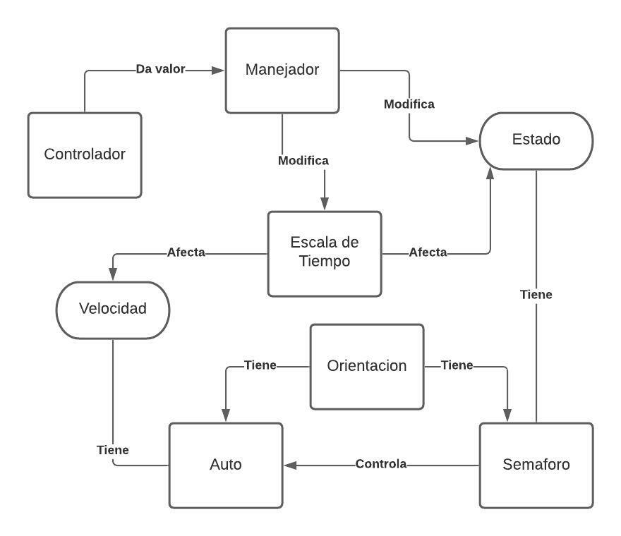

# Proyecto de Threading: Traffic Simulator
## Threading
Un thread o hilo es un flujo de control dentro de un programa. Los programas tradicionales funcionaban en un solo hilo, por lo que todos los procedimientos eran ejecutados de forma secuencial. Sin embargo con el desarrollo de los microprocesadores con sus multiples nucleos con la capacidad de ejecutar varios hilos, tenemos la posibilidad de realizar difentes tareas simulataneamente en multiples hilos, haciendo asi que se puedan ejecutar programas mas complejos, de manera mas rapida.
## Simulador de Trafico
### Intro
En este proyecto se busca simular el trafico de una interseccion. Para simplicidad de la simulación, los autos solamente cruzan la interseccion, no se contempla las situaciones de cambiar de avenida. Para lograr esto se debieron tomar en cuenta diferentes exigencias:
1. Los semaforos son entidades individuales, pero deben cambiar simultaneamente
2. Los autos deben tomar en cuenta el semaforo de su orientacion
3. Un controlador para regular la velocidad de la simulacion
### Diseño
Si analizamos el flujo de trafico, podemos reducirlo a lo que pasa en un solo carril, un auto corre hacia adelante y se detiene dependiendo del estado en el que este el semaforo. Por lo que se puede ver, el semaforo es el que tiene el control sobre el auto, por lo que tiene responsabilidad sobre la interaccion de su auto con los de los otros carriles. Finalmente, hay semaforos que pueden durar mas que otros en un estado, ademas que necesitamos sincronizar los semaforos de la misma avenida y hacer estos cambios simulataneamente, sin mencionar que el cambio de estado no es actualizado cada frame, sino que cambian en intervalos determinados. Por esta razon debemos implementar hilos, para controlar el flujo de los comandos que se le da a cada semaforo. Para manejar estos hilos se crea un Manejador (Manager), el cual tiene pendiente el estado de todos los semaforos, ademas de ejecutar la simulacion en la velocidad determinada por el controlador.
Las relaciones entre los componentes se puede apreciar en este esquema:

Como podra notar, los autos son vinculados con sus respectivos semaforos a traves de su orientacion, propiedad que comparten ambas entidades. 
### Threading
Para implementar hilos en este proyecto utilice coroutine, una clase de funcion propiciada por Unity para pausar la ejecucion de cambio de estado en los semaforos. Para realizar una corutina, se debe encapsular la funcion en un enumerador; en este caso encapsule el flujo de trafico.

IEnumerator trafficFlow()
    {
        while (true)
        {
            upDownGo();
            yield return new WaitForSeconds(5);

            trafficWarning();
            yield return new WaitForSeconds(3);

            leftRightGo();
            yield return new WaitForSeconds(4);

            trafficWarning();
            yield return new WaitForSeconds(3);
        }
    }

